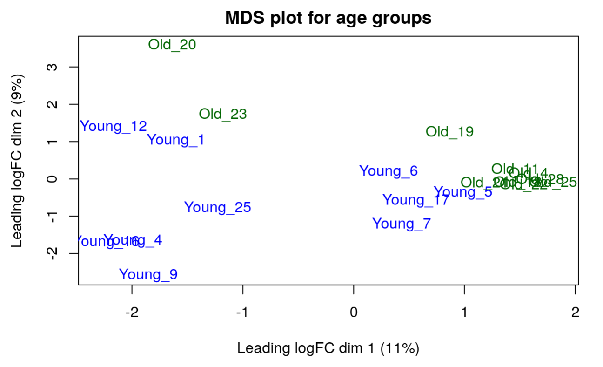

<style type="text/css">
  body{
  font-size: 12pt;
}
</style>

## Introduction

- Aged hematopoietic stem cells (HSC) display functional decline and associated with an increased risk of myeloid malignancies [@beerman2013proliferation]. To investigate the genomic mechanism of the epigenetic differences in aged HSCe, in our first assignment, we selected an GEO dataset from Adelman et al. (accession number [GSE104406](https://www.ncbi.nlm.nih.gov/geo/query/acc.cgi?acc=GSE104406)), that is an RNA-sequencing (RNA-seq) profiles of 10 young and 10 aged Lineage−CD34+CD38− cells [HSC-enriched (HSCe)] samples [@adelman_aging_2019].
  -  Each sample will have `age_group`, `patient`, and `age` attribute:
    * `age_group` denotes the age group of the sample donor.
    * `patient` is an unique id.

- In our first assignment, we performed data cleaning, normalization, mapped HUGO symbols, and analysed the result.

  * For purpose of quality control, genes with low counts (less then 1 count per million) and non integer gene counts are removed, left with total of 14383 genes.
  * Then, TMM(weighted trimmed mean of M-values) in [edgeR](https://bioconductor.org/packages/release/bioc/html/edgeR.html) package was used to normalize the gene counts. [@robinson2010edger] The distribution is more concentrated, with less extremes, and more consistent accross the samples.
  * Eventually 13207 Emsembl gene ids from the original dataset are successfully mapped HUGO gene symbols using [biomaRt](https://bioconductor.org/packages/release/bioc/html/biomaRt.html) package. [@durinck2009mapping] After removing lower counts and genes that cannot be mapped to HUGO symbols.
  * After the normalization, multidimensional scaling plot (MDS) shows that the separated clusters of old and young group, suggesting the samples from the two groups can be distinguished based on their gene expression patterns.
```{r}

```


## Dependencies and Data Preperation

### Packages

```{r, message = FALSE, warning=FALSE}
if (! requireNamespace("BiocManager", quietly = TRUE)) {
  install.packages("BiocManager")
}

if (! requireNamespace("limma", quietly = TRUE)) {
  BiocManager::install("limma")
}

if (! requireNamespace("knitr", quietly = TRUE)) {
  install.packages("knitr")
}

if (! requireNamespace("dplyr", quietly = TRUE)) {
  install.packages("dplyr")
}

if (! requireNamespace("edgeR", quietly = TRUE)) {
  BiocManager::install("edgeR")
}

if (! requireNamespace("ComplexHeatmap", quietly = TRUE)) {
  BiocManager::install("ComplexHeatmap")
}

if (! requireNamespace("circlize", quietly = TRUE)) {
  BiocManager::install("circlize")
}

if (!requireNamespace("EnhancedVolcano", quietly = TRUE)) {
    BiocManager::install("EnhancedVolcano")
}
if (!requireNamespace("gprofiler2", quietly = TRUE)) {
    install.packages("gprofiler2")
}

library(Biobase)
library(knitr)
# control variables
library(edgeR)
library(limma)
library(dplyr)
# Volcano
library(EnhancedVolcano)
# heatmap
library(ComplexHeatmap)
library(circlize)
library(gprofiler2)
```

### load data

- We load the normalized dataset and the sample matrix that contains the study design from Assignment 1.

- The normalized count is has 22 columns (20 samples, one column for emsembl gene id, one column for HUGO symbols).

```{r, warning = F}
normalized_count_data <- read.table("A2_data/GSE104406_finalized_normalized_counts",
                                    header = TRUE, row.names = 1,
                                    sep = ",",stringsAsFactors = FALSE,
                                    check.names=FALSE)
normalized_count_data <-normalized_count_data[match(
  unique(normalized_count_data$hgnc_symbol), 
  normalized_count_data$hgnc_symbol), ]
kable(normalized_count_data[1:5,1:5], type="html")
```

- The sample matrix that contains our study design:
  -  Each sample will have `age_group`, `patient`, and `age` attribute:
    * `age_group` denotes the age group of the sample donor.
    * `patient` is an unique id.
    * `gender` information is also included, "M" for male and "F" for female.
    
```{r}
samples <- read.table("A2_data/GSE104406_samples",
                      header = TRUE,sep = ",",
                      stringsAsFactors = FALSE,
                      check.names=FALSE)
kable(samples[5:15, ],  format = "html")
```

## Differential Gene Expression Analysis

- From the MDS mentioned above, separated clusters of old and young group verifies that "age" is a potential factor that affects gene expression, which aligns with our research interest of investigate the genomic differences (i.e. expression difference) in aged HSCe.

- Also in the MDS, we found 3 outliers of the old group, and their genders are all women. Thus we also want to take the factor gender in to account.

- We use `age` to calculate the differential expression.

### Model Design

- First, we define a design matrix.

- We will use Young group as the control group (reference level) and gives it an indicator variable: 0, while denoting the Old group as 1.

- We also want to take into account that gender can be important factor, set "M" which is male as the reference level to see the impact of female to the model.

```{r}
# refactor reference level for gender
samples$gender <- relevel(as.factor(samples$gender), ref = "M")

# refactor reference level for age group
samples$age_group <- relevel(as.factor(samples$age_group), ref = "Young")

# Design matrix for 2 factors
model_design <- model.matrix(~  samples$gender + samples$age_group)
kable(model_design[5:15,],type="html")
```

- Then we use edgeR package which tests differential expression using a fitted linear model.

- We get the DEGlist on the main factor we want to investigate: age group. 

```{r}
# filter low counts noise, comparing 10 samples to 10 samples
counts <- normalized_count_data[,3: ncol(normalized_count_data)]

d <- DGEList(counts = counts, group = samples$age_group)
d <- calcNormFactors(d)
```

### Egligibility: Mean-variance Plot

- In order to fit a linear model, our dataset must be negative binomial distribution.

- We calculate dispersion, then use MV plot to check our assumption and estimates the global variation across the samples.

```{r}
# dispersion
d <- estimateDisp(d, model_design)

# egdeR plot
plotMeanVar(d, 
            show.raw.vars = TRUE, 
            show.tagwise.vars=TRUE, 
            show.ave.raw.vars = TRUE,  
            NBline=TRUE,
            show.binned.common.disp.vars = TRUE,
            main = "Mean-Variance Plot for Normalized HSCe age group")

legend("topleft", 
       legend=c("Raw Data", "Tagwise Dispersion", "Average Raw Variances", 
                "Binned Common Dispersion", "Negative Binomial Line"), 
       col = c("grey", "lightblue", "maroon", "red", "dodgerblue2"), 
       pch=c(1,1,4,4,NA), 
       lty=c(0,0,0,0,1), 
       lwd=c(1,1,1,1,2), 
       cex=0.5)
```

- The blue line shows that our gene count data follows the negative binomial distribution. The MV plot also indicates that the gene expression levels of the two groups are distinct. The blue dots indicating old group samples are more concentrated around the mean variance, while the young group samples are more dispersed.

- Thus we verified that the data negative binomial distributed.

### p-value and testing

- We calculate the p-value for each gene.

- First, set up an expression matrix and use limma package to obtain an ExpressionSet object for downstream analysis.

```{r,warning=FALSE}
# Expression matrix
expressionMatrix <- as.matrix(log2(counts))

rownames(expressionMatrix) <- normalized_count_data$ensembl_gene_id
colnames(expressionMatrix) <- colnames(counts)

minimalSet <- ExpressionSet(assayData=expressionMatrix)

# simple model
fit <- lmFit(minimalSet, model_design)
```
- We use empirical Bayes to compute differential expression for each gene using the model we designed

- Benjamni-hochberg method is chosen to correct the p-value for multiple hypothesis testing.
```{r}
fit2 <- eBayes(fit, trend=TRUE)

# top-hits
top_hits <- topTable(fit2,
                     coef=ncol(model_design),
                     adjust.method = "BH", # adjust for multiple test, Benjamni - hochberg
                     number = nrow(expressionMatrix))
# used RNA seq and add ids and names to the topfit table
output_hits <- merge(normalized_count_data[,1:2],
                     top_hits,
                     by.y=0,by.x=1,
                     all.y=TRUE) 
# rank by pvalue
output_hits <- output_hits[order(output_hits$P.Value),]
kable(output_hits[1:10,2:8],type="html",row.names = FALSE)
```
- We set the threshold p-value < 0.05 and obtain the number of genes passed the test.

```{r}
(p <- length(which(output_hits$P.Value < 0.05)))
```

- After adjustion, now less genes pass the threshold of 0.05.

```{r}
(adj_p <- length(which(output_hits$adj.P.Val < 0.05)))
```

### Volcano plot

- We use EnhancedVolcano package to make the Volcano plot, that visualizes the differential gene expression coloring not differentially expressed genes as grey, color the up-regulated genes with logFC passed the p-value threshold as pink, the down-regulated genes with logFC passed the p-value threshold as blue.

```{r, warning = F}
volcano_obj <- data.frame(
    "HGNC_Symbol" = output_hits$hgnc_symbol,
    "logFC" = output_hits$logFC,
    "adj.P.Val" = output_hits$adj.P.Val
)
  
# plot with package EnhancedVolcano
EnhancedVolcano(volcano_obj,
  lab = volcano_obj$HGNC_Symbol,
  x = 'logFC',
  pCutoff = 0.05,
  y = 'adj.P.Val',
  drawConnectors = TRUE,
  legendPosition = 'left',
  labSize = 3.0,
  legendLabSize = 12,
  title = "Volcano Plot of HSCe",
  subtitle = "adj.p-value cutoff = 0.05, log fold change cutoff=1",
  ylim = c(0,3)
)
```

### Heatmap

- First we want to investigate the gene expression change for the top hits, we will visualize this with a heatmap.

```{r}
top_hits <- output_hits$hgnc_symbol[output_hits$adj.P.Val < 0.05 & abs(output_hits$logFC) > 1]
heatmap_matrix <- counts[normalized_count_data$hgnc_symbol %in% top_hits,]
rownames(heatmap_matrix) <- counts$hgnc_symbol
colnames(heatmap_matrix) <- colnames(counts)

# Then we normalize and rescale the matrix around the mean
heatmap_matrix <- t(scale(t(heatmap_matrix)))
```

- We then translates the obtained gene expression value into a colour scale over many samples and measurements. As now the minimum and maximumn of the matrix is `r min(heatmap_matrix)` which is less then 0, we use 3 colors: blue to white to red to denote the expression levels from low to middle to high.

```{r, warning = F}
# define the 3 colors used
heatmap_col = colorRamp2(c(min(heatmap_matrix), 
                           0, 
                           max(heatmap_matrix)), 
                         c("blue", "white", "red"))
```
```{r}
current_heatmap <- Heatmap(as.matrix(heatmap_matrix),
      show_row_dend = TRUE,show_column_dend = TRUE,
      col=heatmap_col,show_column_names = TRUE, 
      show_row_names = FALSE,show_heatmap_legend = TRUE)
```

```{r}
current_heatmap
```

- The heat map shows clearly cluster on both up and down regulated genes in the age groups, which suggests differentially expressed genes.


## Thresholded over-representation analysis

### Expression of samples

- We run a threshold gene set enrichment analysis on the identified up- and down- regulated genes with the gprofiler2 package.

### Up-regulated genes

- The top 10 up-regulated genes are seleced

```{r}
up_hits <- output_hits$hgnc_symbol[output_hits$adj.P.Val < 0.05 & output_hits$logFC > 1]
gostres <- gost(query = up_hits, 
                organism = "hsapiens", 
                ordered_query = FALSE, 
                multi_query = FALSE, significant = TRUE, exclude_iea = FALSE, 
                measure_underrepresentation = FALSE, evcodes = FALSE, 
                user_threshold = 0.05, correction_method = "fdr", 
                domain_scope = "annotated", custom_bg = NULL, 
                numeric_ns = "", sources = NULL, as_short_link = FALSE)
gostres$result$query <- "Up-Regulated Genes"
gostplot(gostres, interactive = F, )
```

- We then use the result from GO:BP for further enrichment analysis.

```{r}
bp <- gostres$result[gostres$result$source == "GO:BP", ]
sum(bp$significant==TRUE)
```

- There are `r sum(bp$significant==TRUE)` significant pathways returned

- We use a dot plot from ggplot2 to visualize the result of the enrichment analysis.

```{r}
ggplot(bp[1:10,]) + 
  geom_point(aes(
    x = precision, 
    color = p_value,
    y = term_name,
    size = intersection_size)) +
  theme(axis.title.x = element_text(size = 8),
        axis.title.y = element_text(size = 8)) +
  scale_color_gradient(low = "red", high = "blue") +
  labs(x = "Perciesion",
       color = "P-value", 
       size = "Intersected genes", 
       y = NULL)
```
- The result of the enrichment analysis shows a enrichment in the biosynthetic pathways, which is expected as we are investigating the impact of age on the genomic functions of HSCe.The up-regulated expression of biosynthetic-process related genes verifies that the factor age may contribute to increased risk of myeloid malignancies.

### Down-regulated genes

- The top down-regulated genes are seleced

```{r}
down_list <- output_hits$hgnc_symbol[output_hits$adj.P.Val < 0.05 & output_hits$logFC < -1]
gostres <- gost(query = down_list,
                organism = "hsapiens", 
                ordered_query = FALSE, 
                multi_query = FALSE, significant = TRUE, exclude_iea = FALSE, 
                measure_underrepresentation = FALSE, evcodes = FALSE, 
                user_threshold = 0.05, correction_method = "fdr", 
                domain_scope = "annotated", custom_bg = NULL, 
                numeric_ns = "", sources = NULL, as_short_link = FALSE)
gostres$result$query <- "Down-Regulated Genes"
gostplot(gostres, interactive = F, )
```

- We then use the result from GO:BP for further enrichment analysis.

```{r}
bp_down <- gostres$result[gostres$result$source == "GO:BP", ]
sum(bp_down$significant==TRUE)
```

- There are `r sum(bp_down$significant==TRUE)` significant pathways returned

- We use a dot plot from ggplot2 to visualize the result of the enrichment analysis.

```{r}
ggplot(bp_down[1:10,]) + 
  geom_point(aes(
    x = precision, 
    color = p_value,
    y = term_name,
    size = intersection_size)) +
  theme(axis.title.x = element_text(size = 8),
        axis.title.y = element_text(size = 8)) +
  scale_color_gradient(low = "red", high = "blue") +
  labs(x = "Perciesion",
       color = "P-value", 
       size = "Intersected genes", 
       y = NULL)
```
- The result of the enrichment analysis on the down-regulated genes shows a enrichment in the metabolic pathways, which is expected as we are investigating the impact of age on the genomic functions of HSCe.The down-regulated expression of metabolic-process related genes again verifies that the factor age may contribute to increased risk of myeloid malignancies.

### Whole list

- The top hit genes are seleced

```{r}
gostres_all <- gost(query = top_hits,
                organism = "hsapiens", 
                ordered_query = FALSE, 
                multi_query = FALSE, significant = TRUE, exclude_iea = FALSE, 
                measure_underrepresentation = FALSE, evcodes = FALSE, 
                user_threshold = 0.05, correction_method = "fdr", 
                domain_scope = "annotated", custom_bg = NULL, 
                numeric_ns = "", sources = NULL, as_short_link = FALSE)
gostres_all$result$query <- "All Top Hit Genes"
gostplot(gostres_all, interactive = F, )
```

- We then use the result from GO:BP for further enrichment analysis.

```{r}
bp_all <- gostres_all$result[gostres$result$source == "GO:BP", ]
sum(bp_all$significant==TRUE)
```

- There are `r sum(bp_all$significant==TRUE)` significant pathways returned

- We use a dot plot from ggplot2 to visualize the result of the enrichment analysis.

```{r}
ggplot(bp_all[1:10,]) + 
  geom_point(aes(
    x = precision, 
    color = p_value,
    y = term_name,
    size = intersection_size)) +
  theme(axis.title.x = element_text(size = 8),
        axis.title.y = element_text(size = 8)) +
  scale_color_gradient(low = "red", high = "blue") +
  labs(x = "Perciesion",
       color = "P-value", 
       size = "Intersected genes", 
       y = NULL)
```

- The result of the enrichment analysis on the all genes still shows a enrichment in the metabolic pathways, which is consistent with the result of down-regulated gene expression of metabolic-process, with 2 biosynthetic-relayed pathways from the result of up-regulated genes included.

## Interpretation

### Differential Gene Expression
**1. Calculate p-values for each of the genes in your expression set. How many genes were significantly differentially expressed? What thresholds did you use and why?**

- `r p` genes were significantly differentially expressed using the thresholds of p <0.05, which is the most common one used for statistical testing.

**2. Multiple hypothesis testing - correct your p-values using a multiple hypothesis correction method. Which method did you use? And Why? How many genes passed correction?**

- Benjamni-hochberg method is chosen to correct the p-value for multiple hypothesis testing, as it provides a good balance between controlling the FDR and maintaining statistical power to detect true positives (i.e. differentially expressed genes). `r adj_p` genes passed correction.

**3.Show the amount of differentially expressed genes using an MA Plot or a Volcano plot. Highlight genes of interest.**

- Plots where in the Volcano plot section above.

**4. Visualize your top hits using a heatmap. Do you conditions cluster together? Explain why or why not.**

- Plots where in the Heatmap section above. Our conditions (age group) cluster together because we have up and down regulated genes based on age groups.

### Thresholded over-representation analysis

**1. Which method did you choose and why?**

- We chose the top hit gene lists for both up and town regulated genes seperately, as well as the whole gene list, and sent to g:Profiler to perform the gene set enrichment analysis (GSEA).

**2. What annotation data did you use and why? What version of the annotation are you using?
How many genesets were returned with what thresholds?**

- We used multiple annotation data of the latest version(e108_eg55_p17_0254fbf), then restrict to GO:BP. 

- `r sum(bp_all$significant==TRUE)` genesets where returned in total

**3. Run the analysis using the up-regulated set of genes, and the down-regulated set of genes separately. How do these results compare to using the whole list (i.e all differentially expressed genes together vs. the up-regulated and down regulated differentially expressed genes separately)?**

- The result of the enrichment analysis on the all genes still shows a enrichment in the metabolic pathways, which is consistent with the result of down-regulated gene expression of metabolic-process, with 2 biosynthetic-relayed pathways from the result of up-regulated genes included.

### Interpretation

**1. Do the over-representation results support conclusions or mechanism discussed in the original paper?**

- The overall-representation results supports the conclusion.

Can you find evidence, i.e. publications, to support some of the results that you see. How does this evidence support your results.
- Yes I do.