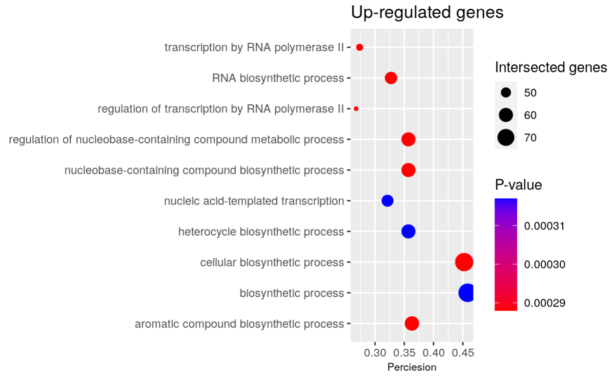

<style type="text/css">
  body{
  font-size: 12pt;
}
</style>

## Introduction

Aged hematopoietic stem cells (HSC) display functional decline and associated with an increased risk of myeloid malignancies [@beerman_proliferation-dependent_2013]. To investigate the genomic mechanism of the epigenetic differences in aged HSCe, in our first assignment, we selected an GEO dataset from Adelman et al. (accession number [GSE104406](https://www.ncbi.nlm.nih.gov/geo/query/acc.cgi?acc=GSE104406)), that is an RNA-sequencing (RNA-seq) profiles of 10 young and 10 aged Lineage−CD34+CD38− cells [HSC-enriched (HSCe)] samples [@adelman_aging_2019].

Each sample will have `age_group`, `patient`, and `age` attribute:
  - `age_group` denotes the age group of the sample donor.
  - `patient` is an unique id.

### Summary of previous assignments

In our first assignment, we performed data cleaning, normalization, mapped HUGO symbols, and analysed the result. First, for purpose of quality control, genes with low counts (less then 1 count per million) and non integer gene counts are removed, left with total of 14383 genes. Then, TMM(weighted trimmed mean of M-values) in [edgeR](https://bioconductor.org/packages/release/bioc/html/edgeR.html) package [@robinson2010edger] was used to normalize the gene counts. The distribution is more concentrated, with less extremes, and more consistent accross the samples.

Eventually 13207 Emsembl gene ids from the original dataset are successfully mapped HUGO gene symbols using [biomaRt](https://bioconductor.org/packages/release/bioc/html/biomaRt.html) [@durinck_mapping_2009] package. After removing lower counts and genes that cannot be mapped to HUGO symbols. After the normalization, a separated clusters of old and young group appeared, suggesting the samples from the two groups can be distinguished based on their gene expression patterns.

In assignment two, differential expression analysis and thresholded over-representation analysis (ORA) were conducted with the normalized expression set with the [edgeR](https://bioconductor.org/packages/release/bioc/html/edgeR.html) package. In the ORA, using the thresholds of p <0.05,  2761 genes were significantly differentially expressed. After Benjamni-hochberg correction, 562 genes passed the threshold illustrating in the the volcano plot (Figure 1)  as the top differential expressed genes between young and aged groups of HSCes. 
```{r fig MDS, fig.cap="\\label{fig:MDS}Figure 1. Volcano plot for the top differentially expressed genes passed 0.05 P-value threshold and with absolute Log fold change greater 1. The top hits highlighted with the corresponding HUGO gene symbels.", echo=FALSE}

```

The result of the enrichment analysis on the all genes shows a enrichment in the metabolic pathways. It is consistent with the result of down-regulated gene expression of metabolic-process which is expected as we are investigating the impact of age on the genomic functions of HSCe. Moreover, 2 biosynthetic-relayed pathways align with the result of up-regulated genes are included. Our finding verifies that the factor age may contribute to increased risk of myeloid malignancies, as proposed by Nakamura-Ishizu et al., during aging, hematopoietic stem cells (HSCs) undergo a transition through multiple hematopoietic sites, which necessitates significant metabolic changes. Which is consistent with our result that the enrichment analysis gives majorly metabolic pathways. [@nakamura-ishizu_hematopoietic_2020]
```{r fig all_dot, fig.cap="\\label{fig:all_gostplot}Figure 2. Dot plot for top 10 thresholded gene list, where top 10 significant pathways that were identified in GO:BP."}

```

## Dependencies and Data Preperation

### Packages

```{r, message = FALSE, warning=FALSE}
if (! requireNamespace("BiocManager", quietly = TRUE)) {
  install.packages("BiocManager")
}

if (! requireNamespace("limma", quietly = TRUE)) {
  BiocManager::install("limma")
}

if (! requireNamespace("knitr", quietly = TRUE)) {
  install.packages("knitr")
}

if (! requireNamespace("dplyr", quietly = TRUE)) {
  install.packages("dplyr")
}

if (! requireNamespace("edgeR", quietly = TRUE)) {
  BiocManager::install("edgeR")
}

if (! requireNamespace("ComplexHeatmap", quietly = TRUE)) {
  BiocManager::install("ComplexHeatmap")
}

if (! requireNamespace("circlize", quietly = TRUE)) {
  BiocManager::install("circlize")
}

if (!requireNamespace("gprofiler2", quietly = TRUE)) {
    install.packages("gprofiler2")
}

library(Biobase)
library(knitr)
# control variables
library(edgeR)
library(limma)
library(dplyr)
# plots
library(ggplot2)
```
- edgeR:  [@robinson2010edger]
- ggplot2: [@wickham2007ggplot]
- circlize: [@gu2014circlize]

### load data

We load the result of differential gene expression analysis between aged and young group from Assignment 2 as our input for this assignment.

```{r, warning = F}
HSCe_output_hits <- read.table("A3_data/HSCe_output_hits",
                                    header = TRUE, row.names = 1,
                                    sep = ",",stringsAsFactors = FALSE,
                                    check.names=FALSE)
kable(HSCe_output_hits[1:10,2:8],type="html",row.names = FALSE)
```


## Non-thresholded Gene set Enrichment Analysis

### Method

We use Gene Set Enrichment Analysis (GSEA) [@subramanian_gene_2005], which is the most common non-thresholded method, on the differential expressed gene list between young and aged groups of Lineage−CD34+CD38− cells. We used the newest geneset collection from the Bader Lab geneset collection [@Bader_2019]: `Human_GOBP_AllPathways_no_GO_iea_March_02_2023_symbol.gmt` as it contain more pathways then GSEA default, and is more up to date.

### Ranked Gene List

The ranked gene list is constructed as the input to GSEA, the rank of each gene is calculated via $$Rank = -log_{10}(p-value) \cdot sign(logFC)$$
```{r}
# Rank calculation
HSCe_output_hits$rank <- (-log(HSCe_output_hits$P.Value, base = 10)) * sign(HSCe_output_hits$logFC)

# order and save rnk file
ranked_list <- HSCe_output_hits[order(HSCe_output_hits$rank, decreasing = T),c("hgnc_symbol", "rank")]
write.table(ranked_list, file = "A3_data/logFC_HSCe_ranked_list.rnk", sep = "\t", 
            quote = FALSE, row.names = FALSE)
```


### Enrichment Results
The enrichment analysis is conducted using GSEA software version `4.3.2` [@subramanian_gene_2005]. The GSEAPreanked mode is used with its default parameters, we changed a few of them to increase specificity without lose of generality.
    - Collapse: No_Collapse
    - Max size: 200
    - Min size: 15

```{r}
up_reg <- read.table(file = "A3_data/HSCe_pos.tsv", sep = '\t', header = TRUE, fill = TRUE)
neg_reg <- read.table(file = "A3_data/HSCe_neg.tsv", sep = '\t', header = TRUE, fill = TRUE)
kable(up_reg[1:10, c(1,4:8)],type="html",row.names = FALSE)
```

We set the aged group as positive, and the young group as negative. It is notable that 0 gene sets are significant at FDR < 25% for the enrichment for the phenotype group: aged, while 754 gene sets are significantly enriched at FDR < 25% for the young group. As discribed in the journal, altering the calculating rank to logFC or increasing FDR threshold did't affect this extreme distribution of geneset. It can be cause by too few factor to be considered in the previously fitted model, for example gender or individuals in each group can also be crucial factors.

Then We use a dot plot from ggplot2 to visualize the result of this non-thresholded enrichment analysis.

```{r fig pos_dot, fig.cap="\\label{fig:pos_dot}Figure 3. Dot plot for 10 most most statistically significant enriched for aged group in GSEA"}
pos_res <- data.frame(
  # remove %
  pathway = gsub("\\%.*", "", up_reg$NAME),
  size = up_reg$SIZE,
  FDR = up_reg$FDR.q.val,
  es = up_reg$ES
)
ggplot(pos_res[1:10,]) + 
  geom_point(aes(
    x = es, 
    color = FDR,
    y = pathway,
    size = size)) +
  theme(axis.title.x = element_text(),
        axis.title.y = element_text()) +
  scale_color_gradient(low = "red", high = "blue") +
  labs(x = "Enrichment Score",
       color = "FDR", 
       size = "Genesize set", 
       y = NULL,
       title = "Top enriched gene sets in the aged group")
```
```{r fig neg_dot, fig.cap="\\label{fig:neg_dot}Figure 4. Dot plot for 10 most most statistically significant enriched for young group in GSEA"}
neg_res <- data.frame(
  # remove %
  pathway = gsub("\\%.*", "", neg_reg$NAME),
  size =  neg_reg$SIZE,
  FDR = neg_reg$FDR.q.val,
  es = neg_reg$ES
)
ggplot(neg_res[1:10,]) + 
  geom_point(aes(
    x = es, 
    color = FDR,
    y = pathway,
    size = size)) +
  theme(axis.title.x = element_text(),
        axis.title.y = element_text()) +
  scale_color_gradient(low = "red", high = "blue") +
  labs(x = "Enrichment Score",
       color = "FDR", 
       size = "Genesize set", 
       y = NULL,
       title = "Top enriched gene sets in the aged group")
```
From Figure 3 and Figure 4, the top gene set returned for the aged group shows a enrichment in the metabolic, biosynthetic or immuno-response pathways, which is expected as we are investigating the impact of age on the genomic functions of HSCe. The results are consistent with recent studies that have associated functional differences in hematopoietic stem cells (HSCs) across various life stages with their distinct metabolic phenotypes, which are regulated by their respective niches [@signer_haematopoietic_2014]. This finding further supports the notion that age may be a contributing factor to the increased risk of myeloid malignancies. In comparison, the top gene set returned for the aged group shows a enrichment in protein synsthesis, aligns with previous finding that increased or decreased protein synthesis impairs HSC function [@roy_energy_2018].


### Compare To Previous ORA
```{r fig compare,echo=FALSE, fig.cap="\\label{fig:compare}Figure 5. Up and down regulated gene sets from previous ORA, with colour of the dots indicates significance level.",fig.show='hold',fig.align='center',out.width="50%"}


```
Upon comparing the previous over-representation analysis (ORA) results depicted in Figure 5 with our gene set enrichment analysis (GSEA) results quantitatively, it is evident that the two sets of results share a high degree of similarity. Both analyses exhibit enrichment in metabolic pathways and biosynthesis-related pathways. Interestingly, GSEA reveals enrichment in immune-response pathways, which are not present among the top 10 up- or down-regulated enriched gene sets in the ORA results. This discrepancy could be attributed to the p-value threshold of <0.05 employed in ORA, which may have resulted in the filtering out of this term.

Furthermore, it is important to note that this comparison is NOT entirely straightforward due to the limited methodology employed to assess the consistency between the most significant results and the distinct gene sets used for enrichment analysis. Only quantitatively comparing and contrasting the top 10 terms of the enriched genes, without using the other information included can affect our interpretation. Moreover, we limited the collection of GO:BP for ORA, which is merely a subset of the Bader Lab geneset we used for GSEA, this inconsistency of gene set can only be qualitative.

## Visualize Analysis in Cytoscape

### Enrichment Map

We use the EnrichmentMap app [@Merico2010EnrichmentMA] in Cytoscape [@Shannon2003CytoscapeAS] to visualize the result from GSEA enrichment analysis. As previously discussed, the false discovery rate (FDR) of enrichment in the aged group is unusually high. Lowering the FDR threshold would not yield any clusters of enriched genes in the aged group. Consequently, we increased the FDR threshold to 0.6, resulting in 694 gene sets for analysis. The default parameters were used, and edge values below 0.375 were filtered out.

```{r fig EM, fig.cap="\\label{fig:EM}Figure 6. Enrichment map for aged(red) and young(blue) HSCes with FDR < 0.6 .", echo=FALSE}

```

### Annotatted Network

We then apply the AutoAnnotate app [@autoannotate] in Cytoscape [@Shannon2003CytoscapeAS] to annotate the resulting Enrichment Map. We manually eliminated several clusters and nodes to increase the readability of the annotation graph, as discussed in the journal. The MCL (Markov Cluster) clustering algorithm is employed for annotating the common labels among nodes, because its efficiency and effectiveness for detecting clusters in large networks, particularly those representing biological data. Moreover, max word per label leaving is 3 and minimum word occurrence is 1 as the default setting of the app. 

```{r fig annotated, fig.cap="\\label{fig:EM}Figure 7. Annotated enrichment map for aged(red) and young(blue) HSCes with FDR < 0.6 .", echo=FALSE}

```

### Collapse to a Theme Network

We then used AutoAnnotate [@autoannotate] to construct the theme network. The major themes are metabolism and rna binding with is consistent with our previous findings. As there are too few themes associated with aged, we cannot make rigorous conclusion that they fit our proposed model. And interestingly, there are novel themes related to viral double, which is consistent with the previous recognition that functional decline of HSC is related with increased risk of myeloid malignancies.

```{r fig theme, fig.cap="\\label{fig:EM}Figure 8. Annotated enrichment map for aged(red) and young(blue) HSCes with FDR < 0.6 .", echo=FALSE}

```


### Interpretation

**1. Do the enrichment results support conclusions or mechanism discussed in the original paper? How do these results differ from the results you got from Assignment #2 thresholded methods**

The enrichment results provide direct support for the conclusions presented in the original paper. They indicate that the aging process in human HSCs is associated with changes in the epigenetic landscape, and these alterations contribute to the decline in aged HSC functionality and increase the risk of malignant transformation, influencing vital developmental and cancer pathways[@adelman_aging_2019]. Our GSEA results align with the proposed mechanism, demonstrating that the primary pathways involved relate to metabolic biosynthesis and immune response, thus confirming the connection between aged HSCs and an elevated risk of myeloid malignancies.[@king_inflammatory_2011] The GSEA findings are largely consistent with the ORA results, which highlight that the top differentially expressed genes are associated with developmental pathways such as metabolic and biosynthetic processes. However, the ORA additionally emphasizes RNA polymerase II pathways, which have been shown to be linked to histone modifications mentioned in the original paper. In contrast, the GSEA findings underscore an enrichment in immune response.

**2. Can you find evidence, i.e. publications, to support some of the results that you see. How does this evidence support your results.**
Yes, as suggested by the reseach of Nakamura-Ishizu et al., during aging, hematopoietic stem cells (HSCs) undergo a transition through multiple hematopoietic sites, which necessitates significant metabolic changes. This suggests that HSCs have the ability to meet the physiological demands of hematopoiesis. Which is consistent with our result that the enrichment analysis gives majorly metabolic pathways. [@nakamura-ishizu_hematopoietic_2020]
Moreover, Leins et al. proposed that functional changes in the immune system on aging are primarily a consequence of changes in the function of HSCs on aging. [@leins_aged_2018] This proposition is consistent with our findings, which reveal that genes enriched in immune-response related pathways are indeed associated with these changes.

## Post analysis

As the previous researches mentioned that deregulation of hematopoietic transcription factors and immune pathways may be one mechanism contributing to HSC decline with age, and potentially affecting enhancers and other regulatory elements. In order to further explore this possibility, we aim to perform a post-analysis on the primary network, specifically focusing on investigating the associated transcription factors. This additional analysis will serve to strengthen our understanding of the mechanisms underlying the age-related decline in HSC function.

We therefore used the signature gene set of Transcription Factors in the newest from the Bader Lab geneset collection [@Bader_2019], then we used a two-sided Mann_whitney testing with a threshold p value of 0.05.
With the 3 specific transcription factors, which are: SALL4, CEBPZ, and SNRNP70 which are marked as related transcription factors with HSC or myeloid malignancies in previous researches [@king_inflammatory_2011, @roy_energy_2018]

|names  |genes|largest_overlap|Mann_whitney          |
|-------|-----|---------------|----------------------|
|SNRNP70|662	|50	            |1.0545841977460668E-10|
|CEBPZ	|1184	|37	            |3.3938411858613904E-8 |
|SALL4  |1353	|34	            |3.949491436006092E-6  |

The post analysis showed high significance and overlap for the 3 TF.

SALL4 is found to play a crucial role to expand HSCs efficiently and rapidly while maintaining their normal immunophenotypes, morphology, and differentiation potential is essential for aged HSCs which typically exhibit a decline in functionality and an increased risk of malignant transformation. [@aguila_sall4_2011]
CEBPZ was shown to recruit m6A RNA modifying enzymes METTL3, which aligns with our insight that age-related alterations in histone modifications signify a systematic shift in the epigenetic program of HSCe. [@martin_meddling_2018]
SNRNP70 is part of the U1 snRNP complex, which is essential for U1/U2-dependent splice site recognition. Since aged HSCs are characterized by lower protein synthesis rates, SNRNP70 is a crucial transcription factor for aged HSCs as it potentially plays a role in maintaining their functionality and preventing malignant transformation. [@saha_transcriptomic_2019]
